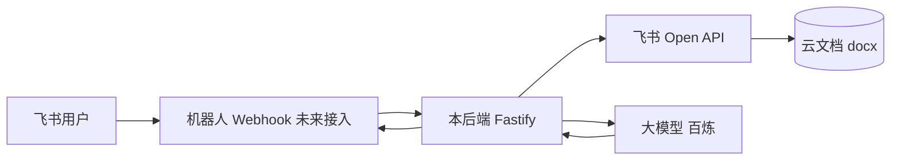

# Phase1：飞书模板 → 读块 → 按节生成 → 写回（MVP）

本阶段**不**把云文档小组件与机器人绑死；**机器人仅作为入口**，核心逻辑全在 `src/phase1` 与 `src/integrations/feishu`。

## 1. 系统流程（文字版）

```text
用户（飞书会话）
    │ 发自然语言需求
    ▼
[机器人] 收消息 → 调后端 HTTP（你配置事件订阅/后续解密）
    │
    ▼
[后端] runPhase1Mvp
    │  select_template: 目前为 .env 固定 FEISHU_TEMPLATE_FILE_TOKEN
    │  copy_template:   POST /drive/v1/files/:token/copy
    │  get_doc_blocks:  GET  /docx/v1/documents/:id/blocks（分页）
    │  locate_sections: 在块纯文本中匹配 [SECTION:XXX]
    │  对每个 section: generate_section_content (百炼) → replaceBlockWithPlainText (batch_update)
    │  reply_doc_link:   POST /im/v1/messages（可选）
    ▼
用户收到「云文档链接」（若配了 chat_id / FEISHU_IM_NOTIFY_CHAT_ID）
```

## 2. Mermaid 总览



## 3. 最小模块（仓库内落点）

| 职责 | 文件 |
|------|------|
| 飞书配置与校验 | `src/integrations/feishu/feishuConfig.ts` |
| 租户 `tenant_access_token` | `src/integrations/feishu/token.ts` |
| 复制文件 | `src/integrations/feishu/driveCopy.ts` |
| 拉块、批量更新 | `src/integrations/feishu/docxBlocks.ts` |
| 发群消息 | `src/integrations/feishu/imMessage.ts` |
| 锚点与默认 section 列表 | `src/phase1/sectionAnchors.ts` |
| 单节 LLM | `src/phase1/llmSection.ts` |
| 主流程 | `src/phase1/pipeline.ts` |
| 机器人侧入口 | `src/phase1/botHandler.ts` |
| HTTP 路由 | `src/api/phase1.ts` |

## 4. 需要调用的飞书 API（MVP 最小集）

| 目的 | 方法 | 路径 / 说明 |
|------|------|-------------|
| 应用身份鉴权 | POST | `https://open.feishu.cn/open-apis/auth/v3/tenant_access_token/internal`（body: app_id, app_secret） |
| 复制云文档到文件夹 | POST | `/open-apis/drive/v1/files/:file_token/copy`（body: name, type: docx, folder_token） |
| 分页取文档下全部块 | GET | `/open-apis/docx/v1/documents/:document_id/blocks`（`page_size`，`page_token` 翻页） |
| 批量更新块内文本 | PATCH | `/open-apis/docx/v1/documents/:document_id/blocks/batch_update`（`requests[].update_text_elements`） |
| 发消息（回链） | POST | `/open-apis/im/v1/messages?receive_id_type=chat_id`（见开放平台「发送消息」） |
| 事件 URL 验证 | POST 回包 | 事件体 `type=url_verification` 时原样返回 `{ "challenge": "..." }`（已实现于 `/api/feishu/webhook`） |

**需在开放平台为应用申请的能力（示例，以控制台实际清单为准）**：`tenant_access_token` 对应应用；上述接口涉及的 **云空间/云文档/IM 发送消息** 等 scope；并确保应用对**源模板、目标文件夹、新文档**有读写协作权限（FAQ：应用权限 ≠ 单篇文档资源权限）。

## 5. 环境变量（请写入工作目录 `.env`）

与 `src/config/env.ts` 中字段一致，至少包含：

- `BAILIAN_*`：原有项（用于按节调用模型）
- `FEISHU_BASE_URL`：默认 `https://open.feishu.cn`
- `FEISHU_APP_ID` / `FEISHU_APP_SECRET`
- `FEISHU_TEMPLATE_FILE_TOKEN`：模板云文档的 file_token
- `FEISHU_TARGET_FOLDER_TOKEN`：复制目标文件夹
- `FEISHU_COPY_NAME_PREFIX`：复制文件名前缀
- `FEISHU_IM_NOTIFY_CHAT_ID`（可选）：发链接用群 `chat_id`；也可在 API 里传 `chatId` 覆盖

> 若无法写入仓库内 `env.example`（受本地权限等影响），以本节为准在本地配置。

## 6. 模板要求（机器友好）

在**新版云文档**中，为每一节各放**一个文本块/标题块**（可独占一行），内容包含**精确锚点**（与 `DEFAULT_SECTIONS` 一致，大小写不敏感）：

- `[SECTION:EXEC_SUMMARY]`
- `[SECTION:KEY_FINDINGS]`
- `[SECTION:DATA_ANALYSIS]`
- `[SECTION:RECOMMENDATIONS]`

生成时会把该块**整段替换**为 `【小标题】+ 模型正文`（见 `src/phase1/pipeline.ts`）。缺失锚点会在结果里 `missingAnchors` 中列出，不会抛异常中断其它节。

## 7. 本地/联调如何调用

1. 配置好 `.env` 与百炼、飞书权限。
2. `npm run dev`。
3. `GET /api/phase1/config-check` 看飞书四项是否已填。
4. `POST /api/phase1/mvp`，JSON 示例：

```json
{
  "userText": "请根据周报模板生成一份 AI 行业周报，语气偏管理向。",
  "chatId": "oc_你的群id"
}
```

- 不传 `chatId` 时，若未设 `FEISHU_IM_NOTIFY_CHAT_ID`，则只返回 `docUrl`，不发 IM。

5. 事件订阅 URL 可填 `https://<你的公网或内网穿透>/api/feishu/webhook`；**仅**完成 **challenge**；真实 **加密消息** 需在下一迭代按官方 decrypt 后调用 `handleBotMessageText`。

6. **资源探针**（不调用 drive copy、不跑生成逻辑）：`GET /api/phase1/debug-resource-check`  
   - 对 `FEISHU_TEMPLATE_FILE_TOKEN` 调 `raw_content` + 首包 `list blocks`；对 `FEISHU_TARGET_FOLDER_TOKEN` 调「创建空白 docx」。  
   - 可选 `?deleteProbeDoc=true` 在目标文件夹创建探针 docx 后自动删除。  
   - 返回体含 `conclusion.hints`，用于区分源不可读、目标不可写、或两者均可但 copy 仍失败（多为 file_token 与 document_id 在 drive 侧不一致）说明。

## 8. 与云文档小组件的关系（第二阶段）

- **MVP 不需要** 启动 `cloudDoc` 子项目。  
- 跑通后，小组件可单独调「同一后端的**按节再生**」接口（后续可加 `POST /api/phase1/regen-section`），传入 `document_id` + `sectionKey`，与机器人解耦。
